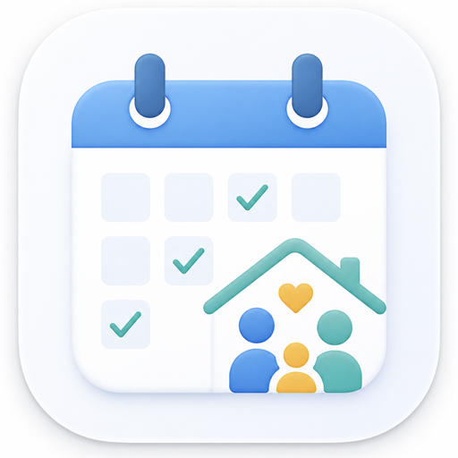
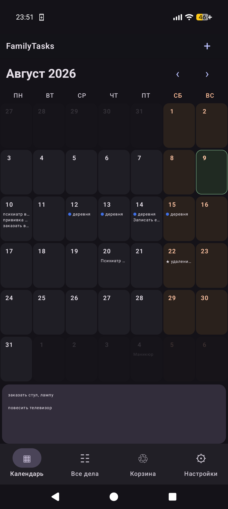
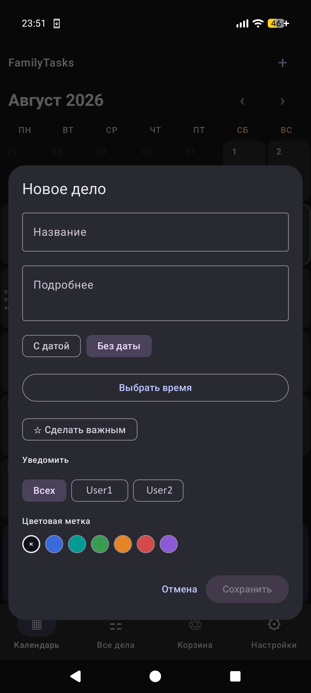
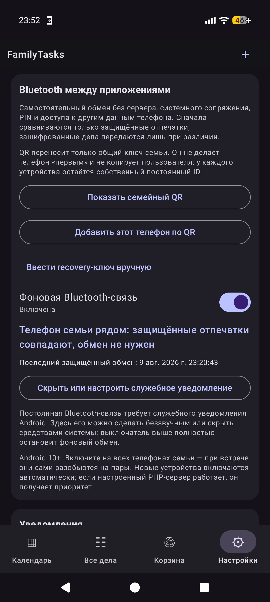

<div align="center">
  

# FamilyTasks

**FamilyTasks — семейный календарь для России без облака и слежки. Синхронизация между телефонами по Bluetooth или через свой сервер.**

Задачи видны прямо в календаре на месяц. Интерфейс и производственный календарь рассчитаны на РФ. Никаких аккаунтов Google, рекламы, аналитики и обязательной подписки.

<a href="https://github.com/alexaistudio/FamilyTasks/releases/latest"></a>

Android 8.0 и новее · [Как установить](#установка) · [Настроить свой сервер](server-v2/README.md)

<p>
  <a href="https://github.com/alexaistudio/FamilyTasks/releases/latest"></a>
  
  
  
  
  
  
  
  
  
  
  
  <a href="#поддержать-разработку"></a>
  <a href="https://github.com/alexaistudio/FamilyTasks/actions/workflows/android.yml"></a>
  <a href="LICENSE.md"></a>
</p>
</div>

## Что это за приложение

FamilyTasks помогает вести общие домашние дела без чужого облака. Открываете календарь и сразу видите, что запланировано у семьи на месяц. Нажатие на день показывает полный список, а дела без даты лежат отдельно, пока вы не решите, когда ими заняться.

У задачи есть название, заметка, дата, время, цвет, важность, повтор и напоминание. Дела можно перетаскивать между днями, менять местами, отмечать выполненными и восстанавливать после удаления.

## Как выглядит

<table>
  <tr>
    <th width="33%">Календарь</th>
    <th width="33%">Новое дело</th>
    <th width="33%">Синхронизация</th>
  </tr>
  <tr>
    <td align="center"></td>
    <td align="center"></td>
    <td align="center"></td>
  </tr>
</table>

## Что умеет

- показывает задачи прямо в месячном календаре;
- хранит дела без даты в отдельном списке;
- поддерживает время, заметки, цвета, важность и повторение;
- напоминает заранее и в момент начала;
- позволяет создать одно дело сразу на несколько дней;
- переносит задачи между днями долгим нажатием;
- показывает российские праздники, выходные и сокращённые дни;
- разделяет все дела на актуальные, выполненные и удалённые;
- уведомляет всех членов семьи или только выбранных людей.

## Откуда берётся производственный календарь

FamilyTasks показывает федеральный производственный календарь РФ для обычной пятидневной недели с выходными в субботу и воскресенье.

[Постоянные праздники из статьи 112 Трудового кодекса РФ](https://git11.rostrud.gov.ru/deyatelnost_gosudarstvennoy-inspektsii-truda/razyasneniya-i-konsultatsii/2025-go45454578d/1561639.html) опубликованы на сайте Роструда. Переносы выходных добавляются только после официальной публикации постановления Правительства:

- [2025 год — постановление Правительства РФ от 04.10.2024 № 1335](https://government.ru/docs/all/155500/);
- [2026 год — постановление Правительства РФ от 24.09.2025 № 1466](https://publication.pravo.gov.ru/document/0001202509240023).

Календарь хранится внутри APK и сам никуда не обращается. Для года с опубликованным постановлением приложение показывает статус «подтверждён». Если переносы на будущий год ещё не утверждены, видны только федеральные праздники и стандартные переносы по ТК РФ, а календарь прямо помечается как предварительный. После выхода нового постановления подтверждённые даты добавляются в очередное обновление FamilyTasks — отдельный сетевой запрос для календаря не нужен.

Региональные праздники, шестидневная неделя и индивидуальные сменные графики в этот календарь не входят.

## Поддержать разработку

Сейчас FamilyTasks рассчитан на Россию. Календари других стран и региональные производственные календари пока не поддерживаются. Если вам нужна другая география, [напишите об этом в Issues](https://github.com/alexaistudio/FamilyTasks/issues) — а если хотите ускорить такую работу, можно поддержать разработку.

**Сеть TRON:** `TMoM4t1JsevXo42cRBiYue51NXrsjuGhqd`

Перед переводом обязательно выберите сеть TRON и ещё раз сверьте адрес. Переводы в блокчейне нельзя отменить.

## Как телефоны обмениваются делами

Можно выбрать один способ или включить оба.

**По Bluetooth.** Телефоны находят друг друга рядом и обмениваются изменениями напрямую. Системное сопряжение и интернет не нужны. Чтобы добавить новый телефон в семью, достаточно отсканировать QR-код внутри приложения.

**Через свой сервер.** Для синхронизации через интернет нужен обычный PHP-хостинг, PHP 8.1+, SQLite и один файл [`sync.php`](server-v2/sync.php). Сервер можно держать у себя или на выбранном хостинге. [Короткая инструкция по настройке](server-v2/README.md).

Если сервер временно недоступен, дела остаются на телефоне и отправятся позже. Параллельные изменения с разных устройств объединяются по логическим версиям, а не по времени на часах.

## Что с приватностью

- В приложении нет рекламы, Firebase, Google Play Services, аналитики и трекеров.
- База на телефоне зашифрована с помощью SQLCipher, а её ключ защищён Android Keystore.
- Перед отправкой данные сжимаются и шифруются AES-256-GCM.
- Сервер хранит зашифрованные пакеты и не получает семейный recovery-ключ.
- Уведомления создаются локально: названия дел не отправляются в push-сервисы.
- Сеть используется только для выбранного вами сервера и проверки новых версий на GitHub.

Владелец сервера видит технические данные соединения — например, IP-адрес, время и размер запроса, — но не названия, даты и заметки без семейного ключа. Подробнее написано в [политике приватности](PRIVACY.md) и [политике безопасности](SECURITY.md).

## Установка

1. Нажмите кнопку **«Скачать APK»** в начале страницы.
2. В последнем релизе скачайте файл `FTasks-<версия>-release.apk`.
3. Разрешите Android установку из этого источника и подтвердите её.

Обновление с тем же production-сертификатом сохраняет дела и настройки. Удаление приложения стирает локальные данные, поэтому перед удалением синхронизируйте телефоны и сохраните recovery-код.

FamilyTasks умеет проверять обновления самостоятельно. Перед установкой приложение сверяет package ID, номер версии, SHA-256 и сертификат подписи APK.

## Для разработчиков

Приложение написано на Kotlin и Jetpack Compose. Локальные данные хранятся через Room и SQLCipher, фоновая работа выполняется WorkManager, прямой обмен использует BLE discovery и временный LE L2CAP-канал. Минимальная версия — Android 8.0, для сборки нужны JDK 17 и Android SDK 35.

```bat
gradlew.bat :v2:testDebugUnitTest :v2:lintDebug :v2:assembleDebug
```

Release-сборка создаётся командой `gradlew.bat :v2:assembleRelease`. Официальные APK подписываются постоянным production-сертификатом; debug-сборки имеют другой package ID и подпись.

Полезные документы: [сервер](server-v2/README.md) · [приватность](PRIVACY.md) · [безопасность](SECURITY.md) · [участие в проекте](CONTRIBUTING.md) · [сторонние компоненты](THIRD_PARTY_NOTICES.md)

## English

FamilyTasks is an Android family calendar that works without a mandatory cloud account, advertising, analytics, or tracking. Phones synchronize encrypted tasks directly over Bluetooth or through a small self-hosted PHP server. Tasks stay in an encrypted local database and are decrypted only on family devices.

[Download the latest APK](https://github.com/alexaistudio/FamilyTasks/releases/latest) · [Server setup](server-v2/README.md) · [Privacy](PRIVACY.md)

## Лицензия

Copyright © 2026 [@alexaistudio](https://github.com/alexaistudio). Использование неизменённого приложения в личных некоммерческих целях разрешено по [PolyForm Strict License 1.0.0](LICENSE.md). Распространение, изменение исходного кода, производные работы и коммерческое использование требуют отдельного письменного разрешения автора.
